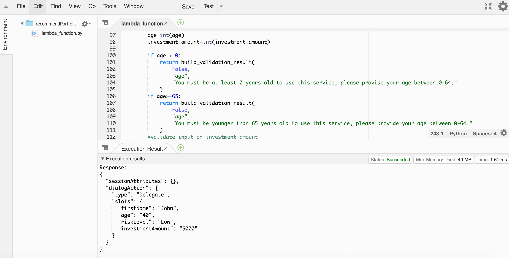

# unit13-challenge

In this activity a test chat bot for a robo advisor was made using amazon lex and aws lamda. 

The following views show inside aws lambda testing the lamda_function.py on the provided test cases.

The function worked for Age Error inputs:

The function was also test for Negative Age Error:

A test was also done for incorrect investment amounts that were not high enough:

Finally it was tested for when a users inputs were valid:

